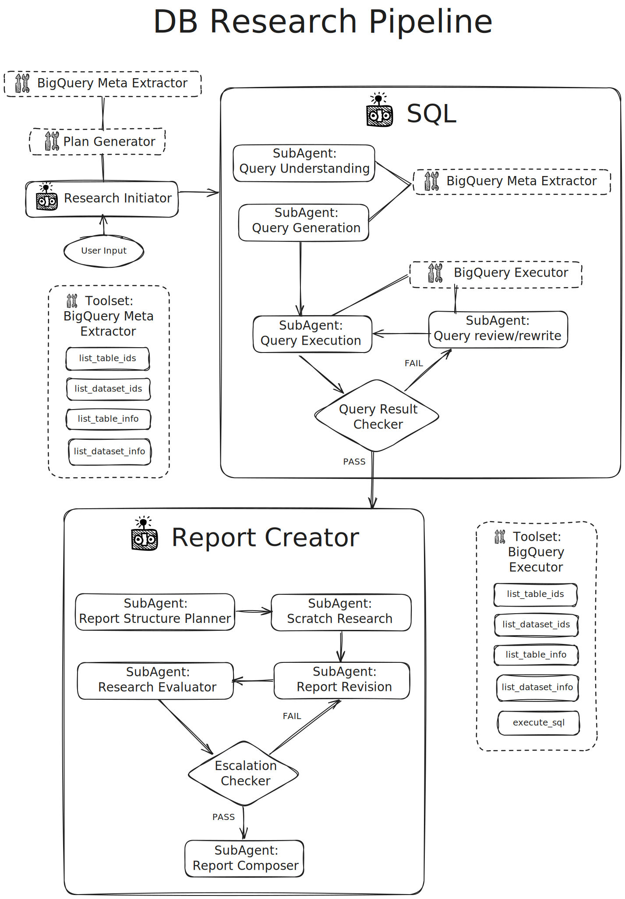

# DAR: Data Agnostic Researcher

An agentic approach to BigQuery table research using Google's ADK (Agent Development Kit).

## BigQuery AI Hackathon
DAR represents a novel approach to database research, leveraging BigQuery's generative AI capabilities to create an
intelligent, autonomous database exploration system. 
Built specifically for the [BigQuery AI Hackathon](https://www.kaggle.com/competitions/bigquery-ai-hackathon/overview), 
this project demonstrates how AI can architect intelligent business applications directly within your data warehouse. 
Drawing inspiration from deep research techniques, DAR automates the process of understanding database schemas,
relationships, and data patterns through autonomous agent workflows powered by Google's Agent Development Kit (ADK).

## Setup and Installation

### Service Account Permissions

The application uses a Google Cloud service account with the following roles:

- **BigQuery Connection User**  
  Allows the service account to use and manage BigQuery connections.  

- **BigQuery Data Viewer**  
  Grants read-only access to BigQuery datasets, tables, and views.  

- **BigQuery Job User**  
  Allows the service account to run BigQuery jobs (queries, exports, loads, etc.).  

- **Vertex AI User**  
  Grants permissions to interact with Vertex AI resources such as models, endpoints, and pipelines.  

These permissions are the minimum required for the application to query data from BigQuery and use Vertex AI for model operations.

### Prerequisites

*   **Google Cloud Account:** You need a Google Cloud account with BigQuery and Vertex enabled.
*   **Python 3.12+:** Ensure you have Python 3.12 or a later version installed.
*   **uv:** Install uv by following the instructions on the official uv website: [https://docs.astral.sh/uv/getting-started/installation/](https://docs.astral.sh/uv/getting-started/installation/)
*   **Git:** Ensure you have git installed.

### Project Setup with uv

1.  **Clone the Repository:**

    ```bash
    git clone https://github.com/MantisAnalytics/DAR
    cd DAR
    ```

2.  **Install Dependencies with uv:**

    ```bash
    uv sync
    ```

    This command reads the `pyproject.toml` file and installs all the necessary
    dependencies into a virtual environment managed by uv. On the first run,
    this command will also create a new virtual environment. By default, the
    virtual environment will be created in a `.venv` directory inside
    `DAR`. If you already have a virtual environment created, or you want to use a different location, you can use
    the `--active` flag for `uv` commands, and/or change the
    `UV_PROJECT_ENVIRONMENT` environment variable. See
    [How to customize uv's virtual environment location](https://pydevtools.com/handbook/how-to/how-to-customize-uvs-virtual-environment-location/)
    for more details.

2.  **Activate the uv Shell:**

    If you are using the `uv` default virtual environment, you now need
    to activate the environment.

    ```bash
    source .venv/bin/activate
    ```

4.  **Set up Environment Variables:**
    
    4.1. Fill the below values in .env.example.

    4.2. Rename the file ".env.example" to ".env"

    Follow the following steps to set up the remaining environment variables.

5.  **BigQuery Setup:**
    For our sample use case, we are working with this dataset that you can find on Kaggle:

    *   First, set the BigQuery project IDs in the `.env` file.
        This should be the same GCP Project you use for `GOOGLE_CLOUD_PROJECT`, you should have access permissions
        to that project.

    *   After loading data to BigQuery table specify the `BQ_DATASET_ID` in the `.env` file as well.
        Make sure you leave `BQ_DATASET_ID='kaggle_BQ_AI'` if you wish to reuse this name data.

6. **Other Environment Variables:**

    *   `CODE_INTERPRETER_EXTENSION_NAME`: (Optional) The full resource name of
        a pre-existing Code Interpreter extension in Vertex AI. If not provided,
        a new extension will be created. (e.g.,
        `projects/<YOUR_PROJECT_ID>/locations/<YOUR_LOCATION>/extensions/<YOUR_EXTENSION_ID>`).
        Check the logs/terminal for the ID of the newly created Code Interpreter
        Extension and provide the value in your environment variables to avoid
        creating multiple extensions.

## Running the App

```bash
cd your-path-to-the-project/DAR
adk web
```

### Project Setup with Docker

### Additional Prerequisites

- Docker installed on your system
- `.env` file configured with your environment variables

### Environment Variables

Create a `.env` file in the project root directory with your required environment variables.
You can find example in .env.example.

### Building the Docker Image

Build the Docker image using the following command:

```bash
docker build -t dar .
```

Replace `dar` with your preferred image name.

## Running the Container

Run the container with your `.env` file:

```bash
docker run -d \
  --name dar-container \
  --env-file .env \
  -p 8000:8000 \
  dar
```

## The AI Architect Approach 
This project fully embraces the *AI Architect* tier by utilizing BigQuery's generative AI functions to: 
- **Generate intelligent queries** using natural language understanding
- **Summarize complex data patterns** across multiple tables
- **Create structured insights** from unstructured exploration results
- **Make intelligent decisions** about research directions
- **Transform findings** into actionable business intelligence



## Key Features
### Agentic Database Exploration 
- **AI-Driven Schema Discovery**: Agents automatically map database structures and identify relationships using generative AI reasoning 
- **Intelligent Data Profiling**: Autonomous analysis of data quality, distributions, and patterns with AI-generated assessments 
- **Smart Relationship Mapping**: AI-powered detection of foreign keys, dependencies, and business relationships

### Deep Research Capabilities 
- **Multi-table AI Analysis**: Agents perform cross-table investigations using generative AI to understand complex data flows 
- **Pattern Recognition**: AI-powered identification of trends, outliers, and data quality issues
- **Performance Intelligence**: Automated query performance evaluation with AI-generated optimization suggestions 

### ADK Integration
- **Agent Orchestration**: Leverage Google ADK for managing multiple research agents with BigQuery AI coordination
- **Workflow Automation**: Define and execute complex AI-driven research workflows

## Hackathon Innovation Highlights 
### Novel AI Integration
- **First-of-its-kind** agentic approach using BigQuery's native generative AI functions for research in-depth
- **No external dependencies beyond Google’s ecosystem** - everything runs within BigQuery using native AI capabilities
- **Self-improving research** - agents use user's feedback to learn from previous findings and refine future exploration strategies
- **Data Agnostic**: This solution is data- and schema-agnostic, allowing you to use it immediately without modifying the existing architecture or queries.

### Business Value Generation
- **Autonomous insight discovery** reduces manual analysis time by 90% through AI-powered exploration 
- **Intelligent business intelligence** could generate actionable recommendations directly from data

### Technical Innovation
- **AI-generated research strategies** that adapt to different dataset structures and business contexts
- **Dynamic workflow orchestration** where AI agents make intelligent decisions about research directions
- **Generative report creation** that transforms technical findings into executive-ready insights 

## Use Cases & Applications

| Use Case                                        | Description                                                                                                                                                                                                                       |
|-------------------------------------------------|-----------------------------------------------------------------------------------------------------------------------------------------------------------------------------------------------------------------------------------|
| **Threat Intelligence (Our specific Use Case)** | Collecting and analyzing information about current and emerging cyber threats, we use multiple BigQuery AI tools to synthesize new knowledge.                                                                          |
| Enterprise Data Discovery                       | AI-powered discovery of business-critical datasets where agents use `AI.GENERATE_TABLE` to identify and prioritize the most valuable data assets based on usage patterns, business impact, and strategic importance.              |
| Automated Data Governance                       | Comprehensive AI assessment of data compliance and governance using `AI.GENERATE_BOOL` to identify PII, sensitive data, and regulatory compliance requirements, with `AI.GENERATE` providing detailed governance recommendations. |
| Intelligent Performance Optimization            | AI-driven analysis of query performance and database optimization opportunities, using generative AI to create specific, actionable recommendations for improving system performance and reducing costs.                          |
| Business Intelligence Automation                | Automated generation of executive dashboards and business insights using `AI.GENERATE_TABLE` for structured reports and `AI.GENERATE_TEXT` for narrative business intelligence summaries.                                         |
| Data Quality Management                         | Continuous AI-powered monitoring and assessment of data quality across the organization, with intelligent scoring using `AI.GENERATE_DOUBLE` and automated remediation suggestions.                                               |
